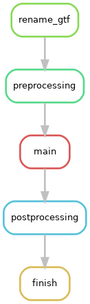

# APAlyzer
APAlyzer utilizes the PAS (polyadenylation sites) collection in the [PolyA_DB database](http://polya-db.org/polya_db/v3/) to examine APA (alternative polyadenylation) events in all genomic regions,
including 3′UTRs and introns.

Sources:
- [Publication](https://academic.oup.com/bioinformatics/article/36/12/3907/5823886)
- [Source code](https://bioconductor.org/packages/release/bioc/html/APAlyzer.html)
- [Software manual](https://bioconductor.org/packages/release/bioc/manuals/APAlyzer/man/APAlyzer.pdf)
- [Github repo](https://github.com/RJWANGbioinfo/APAlyzer)
- [Github analysis example](https://github.com/RJWANGbioinfo/APAlyzer#complete-analysis-example-apa-analysis-in-mouse-testis-versus-heart)

## APAlyzer execution workflow run instructions

### Input file
Required files are to be specified in the input `config/samples.csv`. 
Each row in the sample sheet has two columns:

- condition: name of the condition (e.g control)
- sample: name of the sample (e.g. control_replicate1)
- bam: relative path from APAlyzer working directory to the
       BAM input file for the sample 


It is important to name samples of the same condition with the exact condition name under the condition
column since samples are grouped per condition to be processed by APAlyzer.

### Setting parameters in the config file
Parameters used to run APAlyzer are specified in `config/config.APAlyzer.yaml`.
In the config file, users are able to specify the output directory and output 
file name: `out_dir, out_filename`. <br>

In addition, the relative path from the working directory to the input sample file 
from the previous step is to be specified with parameter `sample_file`. <br>

Other parameters that are important to specify for each run are the
path to GTF annotation file and GTF annotation file organism, 
genome version, and ensemble version details: 
`gtf, gtf_organism, gtf_genome_version, gtf_ensemble_version`.

### Setting up the environment
To run the execution workflow, we first need to activate `apaeval_execution_workflows` conda environment
following the instructions on [APAeval README](https://github.com/iRNA-COSI/APAeval#conda-environment-file).

### Running the workflow
Before running, you can perform a 'dry run' to check which steps will be run and where output files will be 
generated given the provided parameters and input sample file:

```
bash dryrun.sh
```

To run the workflow locally, you can use the provided wrapper script `run_local.sh` which executes with singularity.

```
bash run_local.sh
```

### Output & post-processing
The output of APAlyzer qualifies for _differential challenge_.
The file is postprocessed into a tsv file consisting of a column of
gene ids and another column of pvalues located in `out_dir`
that is specified in the config file `config/config.APAlyzer.yaml`.

## Rulegraph
The rulegraph gives an overview of the steps of the workflow. 
To obtain it, adapt and run the `rulegraph.sh` script.
The current rulegraph is:



## Author contact
If you have any question or comment about APAlyzer, please contact 
Dr. Ruijia Wang (rjwang.bioinfo@gmail.com).
