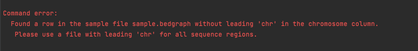

# DaPars
DaPars is a python-based model that directly infers the dynamic alternative polyadenylation (APA)
usage by comparing standard RNA-seq. Given the annotated gene model, DaPars can infer the de novo proximal APA sites 
as well as the long and short 3’UTR expression levels. Finally, it identifies the dynamic APA usages between two 
conditions. 

The [paper](https://www.nature.com/articles/ncomms6274) is titled Dynamic analyses of alternative polyadenylation from 
RNA-seq reveal a 3′-UTR landscape across seven tumour types  
The [application download](https://github.com/ZhengXia/dapars) is free to download
and [documentation](http://xiazlab.org/dapars_tutorial/html/DaPars.html) was used as a reference
to create the nextflow pipeline flow of this module

## Running DaPars workflow

### Input & pre-processing
An example sample sheet is available at `samplesheet_example_files.csv`. Each row in the samplesheet has four
columns:

- sample: name of the sample for logs (e.g control_replicate1)
- condition: name of the condition (e.g Control) 
- bam: BAM input file for the sample 
- bai: BAI index file for sample's bam input

It is important to name samples of the same condition with the exact condition name under the condition
column in the samplesheet since samples are grouped per condition to be processed in the differential step.
To run DaPars with test data provided for APAeval, check the path to DaPars with `pwd` and replace 
the `path_to` in samplesheet_example_files.csv or samplesheet_example_files_identification.csv with the path 
from the `pwd` command. 

When using your own data and input file instead of the provided test data and sample sheet, make sure to include in the 
input file you are using the absolute paths to the four files, with the four column names following the column
names above.

### Running with Docker or Singularity
## Docker
This workflow uses docker containers. To run with docker, make sure that docker is installed and running 
(e.g. to ensure docker is running, run the command `docker --help` and a help message should be printed).
Additionally, make sure that line 49 in Dapars/nextflow.config file `docker.enabled=true` is uncommented while line
51 `singularity.enabled=true` is commented out

## Singularity
To run with singularity, comment out line 49 in Dapars/nextflow.config file `docker.enabled=true` and make sure that line
51 `singularity.enabled=true` is uncommented

### Parameters
Parameters used to run the two steps of DaPars are specified in conf/modules.config file. 
Parameters relevant to the workflow itself are:
- `run_identification` - set to true to obtain identification challenge output. Specifying any other value will throw an error.
- `run_differential` - set to true to obtain differential challenge output. Specifying any other value will throw an error.
- `output_dir` - name of the folder that the final output files are going to be in, located under Dapars/results/dapars/
- `output_file` - name of the output file for the current run ending with .bed if running identification and .tsv if running differential
- `genome_file` - absolute path from the DaPars folder to the input GTF annotation file can be obtained by replacing `path_to`
   with the path to DaPars, and if using your own genome file, make sure to use the absolute path to your genome file

### Running the differential workflow
- Set the 'run_differential' parameter in conf/modules.config to true
- Change 'differential_out' parameter in conf/modules.config to the desired file name that ends with '.tsv'
- Ensure the sample sheet contains exactly two distinct conditions in the condition column. An example input file 
  is samplesheet_example_files.csv

### Running the identification workflow
- Set the 'run_identification' parameter in conf/modules.config to true
- Change 'identification_out_suffix' parameter in conf/modules.config to 
  the desired file suffix that ends with '.bed'
- Sample name for each row in the sample sheet should be unique
- Every sample (every row) in the sample sheet will run through the identification workflow

### Running the workflow
Once parameters have been set in conf/modules.config file, run the pilot benchmark nextflow pipeline with 
`nextflow main.nf --input samplesheet_example_files.csv`. 

## Output & post-processing
When using the default output_dir parameter value in conf/modules.config, DaPars store results under
DaPars/results/dapars/challenge_outputs folder. For identification 
outputs, the files have sample names as prefixes to differentiate the different runs. The differential output file 
will stay as the name specified in modules.config file.

## Notes
- It is not possible to obtain quantification challenge output data since the TPM value in the output file
  is provided per transcript instead of per site. Hence, this tool is not compatible for quantification
  challenge. 
- Make sure that the input bam files have leading 'chr' in the chromosome column. Otherwise, once 
  converted to input bedgraph file for DaPars, the workflow will exit with an error

   This is because DaPars checks for the leading 'chr' in the process and would error out otherwise.
   Hence, we've added a step to check for this leading 'chr' early in the workflow to prevent having to
   go through the entire workflow before erroring out for efficiency.
- DaPars' [documentation](http://xiazlab.org/dapars_tutorial/html/DaPars.html) specifies that a gene symbol file
  is required. The gene symbol file consists of a column of transcript id and another column of gene symbol. This
  file is then used to include the gene symbol for each row in the output file under `Gene` column, for example looks
  like `ENSMUST00000203335.1|Wnk1|chr6|-`. However, since the differential output file requires a gene id instead of a 
  gene symbol, this workflow extracts a gene symbol file required by DaPars by populating it with transcript id and gene id,
  such that the `Gene` column in Dapars' output file looks like `ENSMUST00000203335.1|ENSMUSG00000045962.16|chr6|-`.The gene
  id for each row can then be easily extracted for differential output file by taking the second item from the output above.

## Author contact
If you have any question or comment about DaPars, please post on DaPars Google Groups (https://groups.google.com/u/1/g/DaPars) or the author, Dr. Zheng Xia (xiaz@ohsu.edu).
