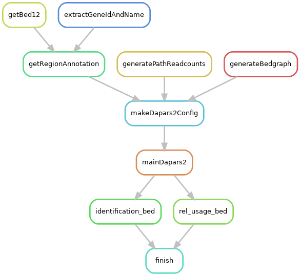

# DaPars2

Execution workflow to run DaPars2. The tool qualifies for the following APAeval benchmarking events:
- poly(A) site identification
- poly(A) site relative usage quantification

See [Notes section](#notes) for clarifications on exclusion from the TPM quantification and differential usage challenges.


Github repo: https://github.com/3UTR/DaPars2

Documentation: http://bioinfo.szbl.ac.cn/DaPars2/DaPars2.html

Citations:
- Feng X, Li L, Wagner EJ, Li W; TC3A: The Cancer 3′ UTR Atlas, Nucleic Acids Research, Volume 46, Issue D1, 4 January 2018, Pages D1027–D1030
- Li L^, Huang K^, Gao YP, Cui Y, Wang G, Nathan D, Li YM, Chen YE, Ji P, Peng F, William K, Wagner EJ, Li W. (2021) An atlas of alternative polyadenylation quantitative trait loci contributing to complex trait and disease heritability. Nature Genetics. doi: 10.1038/s41588-021-00864-5.

## Rulegraph



## Input & pre-processing

The pipeline requires a 2-column, comma-separated sample table with the following headers included:

- `sample` - unique name of the sample
- `bam` - path to BAM file of aligned reads for sample. It is expected (but not required) that an index file is present in the same location (suffixed with `.bai`)

An example sample table can be found at `config/samples.csv` which can be used for APAeval test data.

The config file `config/config.DaPars2.yaml` also needs to be updated with run-specific information. Parameters are described further in comments in the file.


## Running instructions

Activate the `apaeval_execution_workflows` conda environment ('environment' YAML file available at the base of the main repo at `apaeval_env.yaml`). If you haven't installed the environment, execute the following command (assuming you're in the same directory as this README):

```
conda env create -f ../../../apaeval_env.yaml`
```

Once installed, activate the environment with the command below:

```
conda activate apaeval_execution_workflows
```

Before running, you can perform a 'dry run' to check which steps will be run and where output files will be generated given the provided parameters and input files:

```
bash dryrun.sh
```

To run the workflow locally, you can use the provided wrapper script `run_local.sh`.

**Note: The run_local.sh script is currently set up to run with the APAeval test data**. If you have specified **absolute paths** in your sample sheet (e.g. `config/samples.csv`) or the config file (`config/config.DaPars2.yaml`), or have input data that is **not in the current directory**, you will need to modify Singularity bind arguments so the input files will be available to the container.

e.g. The path to the input GTF file is `/share/annotation/annotation.gtf`, and my current working directory is `/home/sam/DaPars2_snakemake/`. Modify the `--singularity-args` line in `run_local.sh` like below to ensure the file is available to the container:

```
--sigularity-args="--bind /share/" \
```

If you are satisfied with the bind arguments, you can run the workflow locally with the following command:

```
bash run_local.sh
```


## Output & post-processing
> *  DaPars2 output tables are generated per chromosome for each sample. Under the main results directory, these are available at `intermediate_<sample_name>/apa_<chr_name>/apa_result_temp.<chr_name>.txt`
> * BED file of identified proximal and distal poly(A) sites per sample, generated at the base of the main results directory at `<sample_name><out_id_bed_suffix>` (out_id_bed_suffix is defined in `config/config.DaPars2.yaml`). The BED file is **unsorted**.
> * BED file of identified proximal and distal poly(A) sites per sample along with their fractional relative usage to other PAS in the same region in the 'score' column. The file is generated at the base of the main results directory at `<sample_name><out_rel_bed_suffix>` (out_rel_bed_suffix is defined in `config/config.DaPars2.yaml`). The BED file is **unsorted**.


## Notes
> * This workflow uses `Dapars2_Multi_Sample.py` where one can assign chromosome name as a command line argument, whereas `DaPars2_Multi_Sample_Multi_Chr.py` is hardcoded for standard human chromosomes with the 'chr' prefix. Both scripts otherwise produce identical output with test data.
> * In [DaPars2 documentation](http://bioinfo.szbl.ac.cn/DaPars2/DaPars2.html), the input files are in wiggle format; however, the testing data that it provides is in bedgraph format. This workflow generates bedgraph files and runs successfully without error on test data
> * The [DaPars2 documentation](http://bioinfo.szbl.ac.cn/DaPars2/DaPars2.html) states a dependency on R but no scripts appears to use R. The Docker image does not install R and Dapars2 runs successfully without error on test data.
> * DaPars2 only provides polyA site quantification through it's relative **P**ercent **D**istal site **U**sage **I**ndex (PDUI) metric. Since DaPars2 uses a '2 site model' for each region, we can obtain the proximal site fractional relative usage by subtracting the PDUI from 1. As such, DaPars2 qualifies for the [relative usage quantification challenge ('Format 04') but not the 'TPM' quantification challenge ('Format 02')](https://github.com/iRNA-COSI/APAeval/blob/main/execution_workflows/execution_output_specification.md#format-02).
> * Unlike DaPars, DaPars2 does not perform differential polyA site usage testing and cannot be included for the differential usage challenge.
> * Owing to bug report at 3UTR/DaPars2#8, the 'Loci' column start coordinates (which originate from a BED file and should follow BED coordinate conventions) are shifted forward by 1nt. If extracted without modification, distal poly(A) sites on the minus strand would be 1nt upstream of the source transcript. 1nt is subtracted from the 'Loci start' coordinate for transcripts on the minus strand to ensure they match the source transcript.
