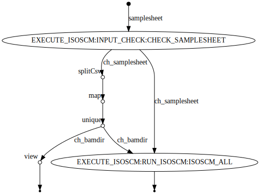

# IsoSCM execution workflow

===== intro =====

Isoform Structural Change Model (IsoSCM) is a method for transcript assembly that incorporates change-point analysis to improve the 3' UTR annotation process.

- Paper: [IsoSCM: improved and alternative 3′ UTR annotation using multiple change-point inference](https://rnajournal.cshlp.org/content/21/1/14)
- GitHub: [shenkers/isoscm](https://github.com/shenkers/isoscm)


## Remapping the testing data
Due to the 'XS' flag issue, I need to redo the STAR alignment with an additional param `--outSAMstrandField intronMotif`. The following snippet is how I generated the new testing data.

```
# get fastq...
samtools view siControl_R1_2genes.bam | awk '{print "@"$1"\n"$10"\n+\n"$11}' > siControl_R1_2genes.fastq
samtools view siSrsf3_R1_2genes.bam | awk '{print "@"$1"\n"$10"\n+\n"$11}' > siSrsf3_R1_2genes.fastq
cat gencode_2genes_noChr.vM18.annotation.gtf | awk '{if($1 ~ /^##/) print $0; else print "chr"$0}' > tmp.gtf #add chr...

# star index
wget http://ftp.ebi.ac.uk/pub/databases/gencode/Gencode_mouse/release_M27/GRCm39.primary_assembly.genome.fa.gz
gunzip GRCm39.primary_assembly.genome.fa.gz

STAR --runMode genomeGenerate --runThreadN 4 --genomeDir star_index/ \
     --genomeFastaFiles GRCm39.primary_assembly.genome.fa \
     --sjdbGTFfile tmp.gtf \
     --sjdbOverhang 74

STAR --runThreadN 4 --outSAMtype BAM SortedByCoordinate --genomeDir ./star_index/ \
     --outSAMstrandField intronMotif  --readFilesIn siControl_R1_2genes.fastq \
     --readFilesCommand cat --outFileNamePrefix new/new_siControl_R1_2genes.

STAR --runThreadN 4 --outSAMtype BAM SortedByCoordinate --genomeDir ./star_index/ \
     --outSAMstrandField intronMotif  --readFilesIn siSrsf3_R1_2genes.fastq \
     --readFilesCommand cat --outFileNamePrefix new/new_siSrsf3_R1_2genes.
     
samtools index new/new_siControl_R1_2genes.Aligned.sortedByCoord.out.bam
samtools index new/new_siSrsf3_R1_2genes.Aligned.sortedByCoord.out.bam
```

These new test data are in the [`test_data`](test_data/) directory.


## Input & pre-processing
Inputs (example sees [samplesheet.csv](./samplesheet.csv)):
  - sample -- unique names of the samples
  - bamdir -- **directory** containing BAMs, note that the **XS flag** for the BAM file is required
  - strandinfo -- the strandedness of sequences, it's either "_reverse_forward_" or "_unstranded_"
  - gtf -- standard gtf annotation file
  - condition -- conditions of the samples (requires at least two conditions)

## Params

- `--input` samplesheet.csv 

## Output & post-processing

IsoSCM consists of the following three steps:
- `assemble`: makes a splice graph, and output changepoints, coverages for the given sample
- `enumerate`: an optional step for visualization
- `compare`: compare samples in the two condition

### Output examples:

- Identification: [siControl_R1_2genes_IsoSCM_01.bed](test_res/siControl_R1_2genes_IsoSCM_01.bed), [siSrsf3_R1_2genes_IsoSCM_01.bed](test_res/siSrsf3_R1_2genes_IsoSCM_01.bed)
- Quantification: [siControl_R1_2genes_IsoSCM_02.bed](test_res/siControl_R1_2genes_IsoSCM_02.bed), [siSrsf3_R1_2genes_IsoSCM_02.bed](test_res/siSrsf3_R1_2genes_IsoSCM_02.bed)
- Differential expression: [IsoSCM_03.txt](test_res/IsoSCM_03.txt)

## Notes

- Install `openjdk-8-jdk`, don't use newer version Java than this
- For duplicates, one should merge all datasets for one condition then run the pipeline, see this [issue](https://github.com/shenkers/isoscm/issues/8)
- Should put all BAM files under the same folder, also `.bai` files are required!
- It's a **DISASTER** to modularize a non-modularized software...... outputs should be in the same working dir so only one process for ISOSCM here:


