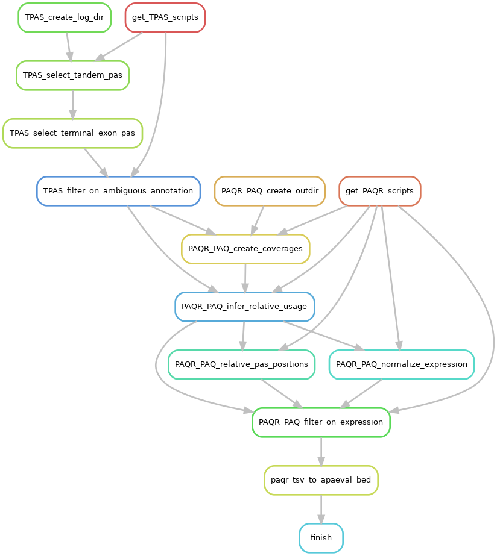

# {Snakemake pipeline template}

## How to create your snakemake pipeline for APAeval
Read this section, but do NOT include it your final README.
> * Copy the whole directory `snakemake` with its' subfolders to suitable location.
> * Rename `snakemake` to `[METHOD]_snakemake`, [METHOD] being the name of the tool you're building a workflow for.
> * Adjust names and contents of files that appear in this [NOTATION].
> * Place any scripts or subworkflows you're going to use into the directories `workflow/scripts` and `workflow/rules`, respectively.
> * Write your workflow in `Snakefile`.
> * Here are the [snakemake docs](https://snakemake.readthedocs.io/en/stable/index.html)
> * Create the [conda](https://docs.conda.io/en/latest/) environment named `snakemake` with `conda env create -f snakemake.yaml`. Alternatively, create an own virtual environment, but ensure to use same versions as in `snakemake.yaml`.
> * General good practices:
>     * Test your code with [snakemake --lint](https://snakemake.readthedocs.io/en/stable/snakefiles/writing_snakefiles.html#best-practices).
>     * One (shell) command per rule. 
>     * If samples differ in a meaningful way (e.g. single end and paired end samples), it might be better to write subworkflows within `workflow/rules`. 
>     * If applicable, each rule has it's own [Docker container](https://www.docker.com/resources/what-container) or conda environment.
> * There are some shell scripts which can be used to start a snakemake run. Adjust the name of the `config file` in these scripts:
>     * `dryrun.sh`
>     * `rulegraph.sh` (Also adjust name of output `.png`)
>     * `run_local.sh`
> * Check out the pilot benchmark at `tests/pilot_benchmark/snakemake` for a running example. It illustrates how the execution workflow can look in practice. 
> * Adjust this `README.md`: Delete this description section and populate the sections below with your awesome experience ;)

# PAQR
## Rulegraph

{The rulegraph gives an overview of the steps of the workflow. To obtain it, adapt and run the `rulegraph.sh` script!}

## Input & pre-processing

{Describe input files and how they will be processed in order for the method to work. Describe how sample tables have to look like, and any other input that is needed (e.g. genome).}

## Params

{Describe parameters needed by your METHOD.}

## Output & post-processing

{Describe output files and postprocessing steps if necessary.}

## Notes

{Notes about the METHOD. 
e.g. Did you have to adjust the method's soure code?
}
