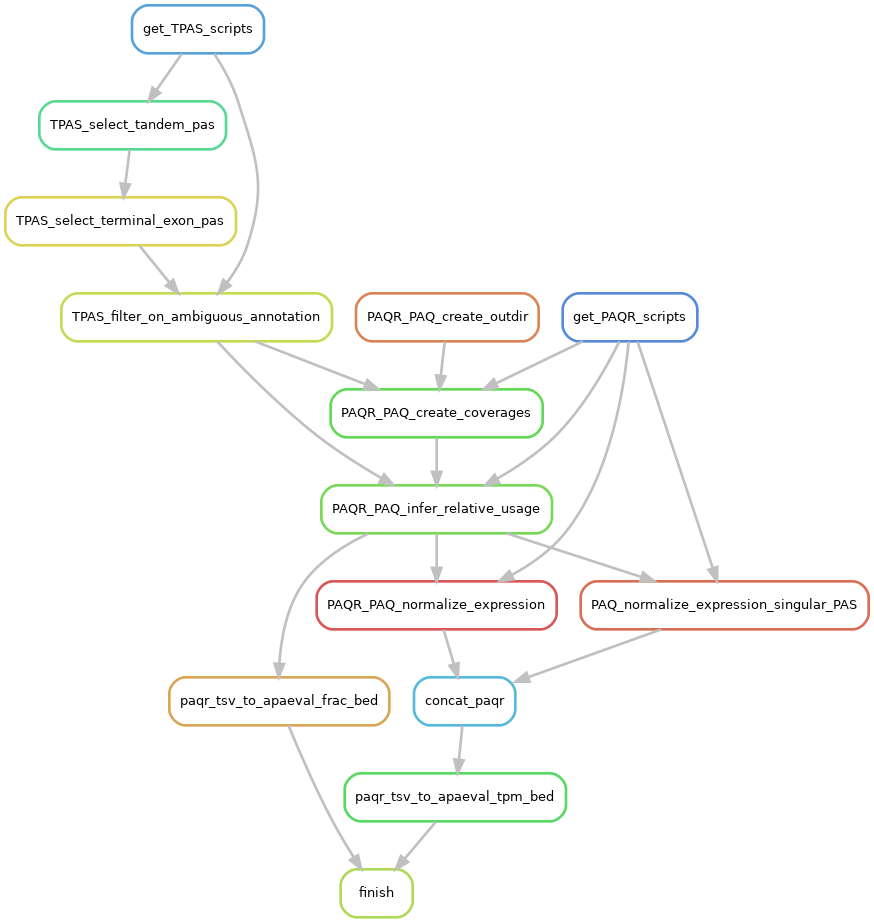

# {Snakemake pipeline template}

## How to create your snakemake pipeline for APAeval
Read this section, but do NOT include it your final README.
> * Copy the whole directory `snakemake` with its' subfolders to suitable location.
> * Rename `snakemake` to `[METHOD]_snakemake`, [METHOD] being the name of the tool you're building a workflow for.
> * Adjust names and contents of files that appear in this [NOTATION].
> * Place any scripts or subworkflows you're going to use into the directories `workflow/scripts` and `workflow/rules`, respectively.
> * Write your workflow in `Snakefile`.
> * Here are the [snakemake docs](https://snakemake.readthedocs.io/en/stable/index.html)
> * Create the [conda](https://docs.conda.io/en/latest/) environment named `snakemake` with `conda env create -f snakemake.yaml`. Alternatively, create an own virtual environment, but ensure to use same versions as in `snakemake.yaml`.
> * General good practices:
>     * Test your code with [snakemake --lint](https://snakemake.readthedocs.io/en/stable/snakefiles/writing_snakefiles.html#best-practices).
>     * One (shell) command per rule. 
>     * If samples differ in a meaningful way (e.g. single end and paired end samples), it might be better to write subworkflows within `workflow/rules`. 
>     * If applicable, each rule has it's own [Docker container](https://www.docker.com/resources/what-container) or conda environment.
> * There are some shell scripts which can be used to start a snakemake run. Adjust the name of the `config file` in these scripts:
>     * `dryrun.sh`
>     * `rulegraph.sh` (Also adjust name of output `.png`)
>     * `run_local.sh`
> * Check out the pilot benchmark at `tests/pilot_benchmark/snakemake` for a running example. It illustrates how the execution workflow can look in practice. 
> * Adjust this `README.md`: Delete this description section and populate the sections below with your awesome experience ;)

# PAQR
## Rulegraph

{The rulegraph gives an overview of the steps of the workflow. To obtain it, adapt and run the `rulegraph.sh` script!}

## Input & pre-processing
> IMPORTANT:   
PAQR requires samples, annotations and reference poly(A) sites files to all use the same chromosome naming scheme ("chr1" in gencode, "1" in ensembl) or else will fail.

{Describe input files and how they will be processed in order for the method to work. Describe how sample tables have to look like, and any other input that is needed (e.g. genome).}

1. Sample files  
`.bam` files of all samples have to be provided alongside their respective `.bai` index files (**in the same directory, with the same basename**)

2. Sample table  
A table specifying all samples to be analyzed has to be provided in `.tsv` format (not `.csv`) and contain the following columns:   

| ID | bam | condition |
| - | - | - |
| siRNA1 | path/to/bamfile1 | KO |
| siRNA2 | path/to/bamfile2 | KO |
| control1 | path/to/bamfile3 | CTRL |
 
See [here][sample-table] for an example. PAQR can be run on one or more samples, and one or more conditions. Conditions are only considered internally (for threshold calculations), the output is given for individual samples.

3. reference poly(A) site file   
This file has to be provided in `.bed` format with one poly(A) site per row. The site ID (column 4) has to be of the form `chr:site:strand` (e.g. "1:123456:+"), where "chr" is the chromosome, "site" is the representative site of the poly(A) site cluster, or the start coordinate in case of individual poly(A) sites, and "strand" is the strand on which the site is located. This format is based on [PolyASite][polyasite-web].
## Params

All parameters are specified (and explained) in `config/config.yaml`. Most of the parameters don't have to be changed for a run with default behaviour, but do make sure the following ones are appropriate for your setup.

> NOTE: some parameters have to be specified more than once, with only slightly different names. Unfortunately, this cannot be avoided, as the workflow imports different individual modules, that all require to use the exact parameter names that are present in their respective published repositories.
### Paths to input files
- `samples`
- `polyasite`
- `gtf`
- `PAQ_samples_table`
- `PAQ_tandem_pas`: This file is created as output of the tandem PAS module and its location and name follows the format `[outdir]/[atlas_version]_tandem_pas.terminal_exons.[strandedness].bed`, where expressions in brackets correspond to the respective values in `config/config.yaml`.

### Data dependent
- `strandedness`: Specify whether the tandem PAS file should be created for use with stranded or unstranded data
- `PAQ_coverage_unstranded`: "no" for stranded data
- `PAQ_read_length`: avg read length of the samples

### Annotation dependent
- `biotype_key`: "transcript_biotype" if using ensembl annotations, "transcript_type" if using gencode

## Output & post-processing

APAeval relevant output: `filtered_pas_expression.tsv`, which contains tpm for each sample from the samples table. This file is converted into the APAeval compatible bed format in a postprocessing rule.   

The final output files are named `[SAMPLE]_[CHALLENGE_CODE]_[PARTICIPANT]_[OUTCODE].bed`, as specified in the ["execution workflow README"][ewf-readme-filenames].

## Notes

The modules inside this workflow are loaded from the following repositories:

- [https://github.com/zavolanlab/tandem-pas](https://github.com/zavolanlab/tandem-pas)
- [https://github.com/zavolanlab/PAQR2](https://github.com/zavolanlab/PAQR2)

[polyasite-web]: <https://polyasite.unibas.ch/atlas>
[sample-table]: config/samples.tsv
[ewf-readme-filenames]: ../README.md#output