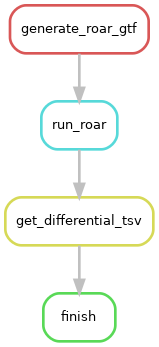

# Roar
Roar detects the potential Alternative Polyadenylation (APA) events in the downstream 3'-UTR of a gene among two different biological conditions.

The Roar execution workflow is currently compatible with the following APAeval challenges:
- Differential challenge

(See [Notes](#Notes) section for clarification on exclusion from other challenges).


* Bioconductor: https://bioconductor.org/packages/release/bioc/html/roar.html
* Vignette: https://bioconductor.org/packages/release/bioc/vignettes/roar/inst/doc/roar.pdf
* Reference Manual: https://bioconductor.org/packages/release/bioc/manuals/roar/man/roar.pdf
* GitHub: https://github.com/vodkatad/roar

# Rulegraph



# Input files & parameters

The below files are provided via the pipeline's config file (`workflow/config/config.Roar.yaml`), which needs to be updated with run-specific information. The config file is currently set up to run directly with APAeval test data (with the exception of downloading reference files, see below for instructions).

The pipeline requires a 3 column, comma-separated sample table with the following headers:
- `sample_name` - unique name/identifier for the sample
- `bam` - path to BAM file of aligned reads for the given sample. It is expected (but not required) that an index file is present in the same location (suffixed with .bai). Roar annotations use UCSC-style seqnames (i.e. have 'chr' prefix), so be sure to check your BAM files contain the same naming convention (the pipeline will not check this)
- `condition` - string identifier for samples belonging to the same group. There must be **exactly two distinct conditions** in this column.

An example sample table can be found at `workflow/config/samples.csv` (works with APAeval test data).

The pipeline also requires additional custom reference files, which can be downloaded from [Roar's GitHub repository](https://github.com/vodkatad/roar/wiki/Identify-differential-APA-usage-from-RNA-seq-alignments). Note that only **human (hg19 & hg38) and mouse (mm9)** annotations are currently available. Annotation types come in two forms, 'single' (only a single proximal polyA site is selected per gene) or 'multiple' (all alternative polyA sites of a gene are provided). Both of these annotation types are supported by the pipeline.

Modify the following parameters in `workflow/config/config.Roar.yaml` to pass the reference annotations to the pipeline:
- `roar_gtf` - path to input Roar annotation file
- `annotation_type` - 'single' for 'single APA' annotations, 'multiple' for 'multiple APA' annotations


# Running instructions

Activate the `apaeval_execution_workflows` conda environment ('environment' YAML file available at the base of the main repo at `apaeval_env.yaml`). If you haven't installed the environment, see the README at the base of the APAeval repository for instructions.

```
conda activate apaeval_execution_workflows
```

Before running, you can perform a 'dry run' to check which steps will be run and where output files will be generated given the provided parameters and input files:

```
bash dryrun.sh
```

To run the workflow locally, you can use the provided wrapper script `run_local.sh`.

**Note: The run_local.sh script is currently set up to run with the APAeval test data**. If you have specified **absolute paths** in your sample sheet (e.g. `workflow/config/samples.csv`) or the config file (`workflow/config/config.Roar.yaml`), or have input data that is **not in the current directory**, you will need to modify Singularity bind arguments so the input files will be available to the container.

e.g. The path to the input GTF file is `/share/annotation/annotation.gtf`, and my current working directory is `/home/sam/DaPars2_snakemake/`. Modify the `--singularity-args` line in `run_local.sh` like below to ensure the file is available to the container:

```
--sigularity-args="--bind /share/" \
```

If you are satisfied with the bind arguments, you can run the workflow locally with the following command:

```
bash run_local.sh
```


# Output files

- TSV file storing results of Roar analysis (dataframe output by the *`totalResults()`* Roar function). In the main results directory this can be found at `roar_results.tsv`.
- TSV file compatible with the [differential usage challenge](https://github.com/iRNA-COSI/APAeval/blob/main/execution_workflows/execution_output_specification.md). In the main results directory this can be found named according to the `<CHALLENGECODE>_<PARTICIPANT>_<OUTCODE>.tsv` [specification](https://github.com/iRNA-COSI/APAeval/blob/main/execution_workflows/README.md#filenames) (each can be customised in the config file).


# Notes
> * Roar does not perform de-novo identification of polyA sites, instead relying on reference polyA sites. As such it is incapable of being compatible with the identification challenge
> * Roar does not output polyA site quantification as TPM values (only a relative change 'roar' (ratio of a ratio) metric and FPKM values), so is currently incompatible with the differential challenge
> * We have attempted to recreate Roar annotations using a custom script - `workflows/scripts/make_roar_annotations.py` - which follows instructions provided in the vignette. The script takes as input a reference GTF and BED file of polyA sites, although it is currently only capable of generating '**[single APA type](https://github.com/vodkatad/roar/wiki/Identify-differential-APA-usage-from-RNA-seq-alignments)**' annotations. We currently have no way of verifying the script as we cannot get access to RefSeq v79 annotations, but it was carefully written to follow the vignette instructions to the literal interpretation as closely as possible. The script was tested using the [PyRanges v0.0.115 Biocontainer](quay.io/biocontainers/pyranges:0.0.115--pyh5e36f6f_0).
> * When defining the 3'end of the proximal polyA site bin (termed the 'PRE' region), the 'end' coordinate is lifted from the 'end' coordinate for the poly(A) site (*`_df_change_coordinate`* function in `workflow/scripts/make_roar_annotations.py`). If you use polyA site clusters (e.g. PolyASite), this will define the polyA site as the 3'end of the cluster, which may not be the most supported position by reads. The script will work if polyAsite coordinates are not single nucleotide, but note this may lead to small inaccuracies in the precise definition of the proximal polyA site.

# Citation

Grassi, E., Mariella, E., Lembo, A. et al. Roar: detecting alternative polyadenylation with standard mRNA sequencing libraries. BMC Bioinformatics 17, 423 (2016). https://doi.org/10.1186/s12859-016-1254-8

# Contact the Author
Elena Grassi - elena.grassi@unito.it, [GitHub](https://github.com/vodkatad)
